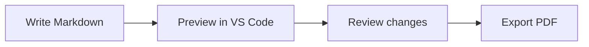

# Documentation Workflow

Markdown is the source of truth. Review changes in version control and export a PDF when a fixed-format copy is needed.

## From Draft to PDF



## Review Checklist

- Use descriptive headings and short paragraphs.
- Keep images in the repository and link to them with relative paths.
- Check the diagram preview and generated PDF before sharing.

| Format | Purpose |
| --- | --- |
| Markdown | Editable source |
| Mermaid | Text-based diagrams |
| PDF | Fixed-format distribution |

## Export Command

```sh
docs-pdf docs/example.md
```

The generated file is `pdf_build/docs/example.pdf`.
