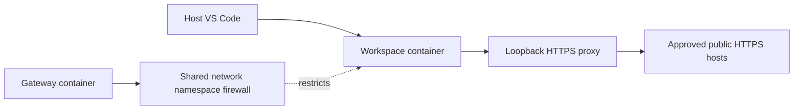

# Security and Network Policy

## Boundary

The template confines ordinary agent commands to a Linux container exposing one repository at `/workspace`. It does not claim a mathematically complete sandbox or protection against Docker/kernel/VS Code vulnerabilities. Use a dedicated VM and an externally enforced launcher for hostile repositories or higher-assurance requirements.

The workspace runs as a non-root user with all capabilities dropped, `no-new-privileges`, a read-only root filesystem, and resource limits. Only the repository, a project-scoped home volume, and temporary storage are writable. There is no Docker socket, privileged mode, host networking, host home mount, or SSH key mount in the checked-in configuration. The agent can still read the container's system tools and its own credentials and editor state.

Two services are needed because the agent must not administer its own firewall:



The gateway initializes the shared network namespace before the workspace starts. Its firewall rejects workspace-originated external traffic and DNS, including Docker's embedded resolver. Only the proxy UID may resolve names and connect to public IPv4 HTTPS destinations. IPv6 egress is denied. Squid admits exact allowlisted CONNECT destinations on port 443 and rejects private addresses. The workspace has a separate filesystem and PID namespace and cannot become the proxy UID or change firewall rules. The gateway drops all its process capabilities after initialization. A stopped proxy leaves the firewall in place and fails closed.

The proxy configuration, Claude managed policy, PDF exporter, and isolation check are **copied into images**, not mounted from writable source files. Editing them in the repository does not change the running policy. A human-approved rebuild is required.

## Host Prerequisites

Use a dedicated VS Code profile with only trusted extensions, no Settings Sync, no automatic dotfiles installation, and no inherited agent/MCP integrations. Before reopening the repository, set these in **host User Settings**, not workspace settings:

```json
{
  "dev.containers.copyGitConfig": false,
  "dev.containers.gitCredentialHelperConfigLocation": "none",
  "dev.containers.dockerCredentialHelper": false,
  "dev.containers.githubCLILoginWithToken": false,
  "dotfiles.repository": "",
  "remote.autoForwardPorts": false,
  "git.autofetch": false
}
```

Dev Containers automatically forwards an available host SSH agent. Do not expose one to this editor instance. On macOS/Linux, launch a **separate VS Code process** with `SSH_AUTH_SOCK` unset; an existing process may keep the old environment. On Windows, ensure the instance has no usable Windows/OpenSSH agent integration. A VS Code profile by itself does not remove environment variables or disable an SSH agent service. Inspect the attached container before enabling an agent. Do not rely on clearing the variable inside the container if a usable socket has already been forwarded.

Do not open additional host folders or files in the container window. Do not attach host browser tools, local MCP servers, WSL interop, remote command services, SSH/GPG agents, or forwarded host ports. Keep agent execution and extension tool execution in the remote container. Generic agents must use this same boundary; `AGENTS.md` alone cannot constrain them.

Never open an agent-edited repository in a trusted **host-executing** window or run its hooks, tasks, scripts, or rebuild configuration without review. In particular, writable `.git` hooks/config and `.vscode` files can affect later host-side actions. Git synchronization normally happens in the container. If you also run Git on the host, disable hooks and review configuration changes first. Keep recoverable backups or committed checkpoints outside the agent's writable working copy.

## Editor and Extension Setup

Dev Containers may install the VS Code server through the host, but remote Marketplace requests are intentionally blocked. The configured extensions are:

- `anthropic.claude-code`
- `bierner.markdown-mermaid`
- `DavidAnson.vscode-markdownlint`

When needed, obtain platform-appropriate VSIX files through the host Marketplace UI, then run **Extensions: Install from VSIX...** in the attached window and verify the destination is the container. The Claude extension needs the container's Linux architecture, not the host's macOS/Windows architecture. Review updates before installing them. Runtime package downloads are not a reason to disable the firewall.

Markdown previews are host-side webviews, so the container firewall cannot govern everything they fetch. Do not loosen preview security or add remote scripts/images. The supplied exporter is stricter: raw HTML is escaped, images must resolve inside the repository, and browser network requests are rejected.

## Verify Before Auto Mode

1. Check the container indicator and use **Developer: Show Running Extensions** to verify Claude runs remotely. Review its available tools and MCP configuration; no host tools should be present.
2. Run `docs-check` inside the workspace. It must pass before autonomous work. If it reports forwarding, remove the host integration and recreate the container; do not suppress the check.
3. From a trusted host terminal, use `docker ps` to identify this workspace and `docker inspect <workspace-container>` to review mounts, capabilities, network mode, and security options. The repo must be the only host project mount; inspect any editor-added volumes or sockets. Reject unexpected home directories, Docker sockets, credentials, and other repositories.
4. Inspect the environment and socket paths without printing tokens. An unset `SSH_AUTH_SOCK` alone is not proof that forwarding is absent. Check the Dev Containers startup log for SSH/GPG/Git/Docker credential forwarding and inspect `/tmp` and editor runtime directories for forwarded sockets.
5. Run `claude auth status` and check `/status` after your own sign-in. Confirm first-party subscription authentication, the expected managed settings, and no unexpected connectors. Organization/server-managed policies can take precedence over image-provided settings; review effective policy rather than assuming the file won.
6. Preview `docs/example.md`, export it, and inspect the result before using the template for real documents.

The executable check is a smoke test, not a security audit. Modified tests cannot attest to themselves. Human review of configuration and runtime state remains required.

## Approve Research Domains

Initially, `.devcontainer/gateway/allowed-domains.txt` contains `api.anthropic.com`, `claude.ai`, `claude.com`, and `platform.claude.com` for Claude, plus `github.com` and `api.github.com` for Git and the GitHub CLI. `platform.claude.com` handles OAuth exchange/refresh even for subscriptions. These are exact matches, not wildcard suffixes.

To approve research:

1. Stop autonomous sessions. A human reviews the destination, intended use, data that may be sent, and any redirects.
2. Add a single exact hostname, such as `developer.mozilla.org`, on its own line in `.devcontainer/gateway/allowed-domains.txt`. Do not include a scheme, path, leading dot, wildcard, IP address, or port. Never approve a general proxy, tunnel service, additional Git host, arbitrary package CDN, or wildcard cloud-storage domain as a shortcut.
3. Prefer fetching approved pages using container-local `curl`. The network allowlist works independently of Claude tool permissions. Keep WebSearch denied: server-side search goes through the permitted model API and is not governed by the research-host list.
4. If Claude WebFetch is specifically needed, a human may remove its blanket deny in `.devcontainer/managed-settings.json`. The gateway still limits local requests to approved hosts. Do not enable account connectors or host/browser tools. The API itself may perform server-side operations; see the limits below.
5. Review the **entire** diff affecting `.devcontainer/`, `.vscode/`, scripts, dependencies, and policy. Rebuild **both services** from a trusted host, then reopen VS Code. Merely editing or restarting the workspace does not update the gateway image.
6. Repeat `docs-check`, confirm the new site works via `curl -I https://developer.mozilla.org`, and confirm an unapproved site still receives proxy HTTP 403. Review redirect hosts separately; blocked redirects are not a reason to add a wildcard. The smoke test uses `example.com` and `gitlab.com` as denied controls, so keep them denied.

For explicit host-side lifecycle control, use a unique Compose project name per checkout. VS Code's Dev Containers log shows the project name it chose. Substitute that **same** name for `YOUR_PROJECT`:

```sh
docker compose -p YOUR_PROJECT -f .devcontainer/compose.yaml down
docker compose -p YOUR_PROJECT -f .devcontainer/compose.yaml build --pull gateway workspace
docker compose -p YOUR_PROJECT -f .devcontainer/compose.yaml up -d --wait
```

Reconnect/reopen the devcontainer afterward. `down` without `--volumes` preserves authentication. Do not reuse project names between repositories, and do not run these commands from an agent. Revocation follows the same process: remove the hostname, stop sessions, rebuild both services, and retest. This terminates existing CONNECT tunnels; editing an allowlist alone does not revoke an already-running image or tunnel.

## GitHub Access

`docs-github-setup` stores a fine-grained personal access token with `gh` in the container's home volume and registers `gh` as Git's credential helper for `github.com` only. SSH-style remotes are rewritten to HTTPS inside the container, because SSH egress is blocked. `docs-check` fails if any other credential helper is configured, which still catches forwarded host credentials.

- Scope the token to this one repository, with Contents read/write, an expiry date, and no other permissions unless `gh` needs them.
- The agent runs as the same user and can read and use the token. Treat everything the token allows as something the agent can do.
- Protect the default branch on GitHub: require pull requests and block force-pushes. That rule is enforced by GitHub, unlike agent instructions.
- Revoke the token on GitHub to cancel it. Deleting local files does not revoke a copied token. Removing the home volume also removes it.
- Do not install the GitHub Pull Requests extension in the container. It requests your host VS Code GitHub session, which is broader than the scoped token.

## Known Limits

- The bind-mounted repository is writable and deletable, including configuration and Git metadata. No agent instruction prevents that. Rebuild approval is a security decision, not a routine auto-approved action.
- Claude subscription credentials and transcripts are readable by processes running as the workspace user. Keep other secrets out. Revoke the subscription session if the container is compromised; deleting local credentials alone does not revoke a stolen token.
- `github.com` is an allowed service. The agent can read any public content there, which may contain instructions aimed at agents, and can push to this repository with the scoped token. Content pushed there leaves the container.
- An HTTPS hostname allowlist is not a read-only policy, URL-path filter, or data-loss-prevention system. Allowed services receive requests and document context. CONNECT does not inspect encrypted payloads, and shared hosting, domain fronting, proxy vulnerabilities, or server-side API tools can weaken destination assumptions. Network policy cannot prevent an arbitrary API client from requesting provider-side research. Claude's tool restrictions are defense in depth, not proof that no remote service can fetch data.
- The running firewall resists ordinary agent commands, not a kernel/container escape. A dedicated VM and host-controlled policy are needed for stronger assurance. Rootless Docker and alternative runtimes are not validated here.
- The PDF browser runs without Chromium's inner sandbox because the container drops the privileges it commonly needs. It uses a fresh page, escaped HTML, strict Mermaid rendering, local assets, and blocked browser requests, but malicious input or browser bugs can still affect the container. Do not render untrusted material containing secrets in the same environment.
- VS Code is a trusted bridge to the host. Host webviews, extension RPC, copied settings, socket forwarding, and newly enabled tools can exceed the Docker boundary. A repository cannot fully police that bridge.
- Build-time dependencies and VSIX installation use host/build network access. They are trusted setup operations outside runtime egress controls. Base tags and OS packages move; keep Docker, images, Chromium, and extensions updated through reviewed maintenance.

## Validation Snapshot

On 2026-09-23, both images built on Docker Desktop for `linux/arm64`. Markdown lint, the Chromium/Mermaid PDF tests, and the isolation check passed. Subscription login, interactive VS Code attachment/preview, and other host platforms still require human verification.

The workspace pins npm 12.1.0 and overrides Mermaid's transitive `lodash-es` to 4.18.0. These changes removed the five fixable high-severity JavaScript findings from the earlier build. Docker Scout's subsequent critical/high scan of the complete images still reported these Debian findings, all with no fixed version available in its database:

| Package | Image | Severity | Findings |
| --- | --- | --- | --- |
| `libdbi-perl` | Gateway | Critical | CVE-2026-78030 |
| `libxml2` | Workspace | High | CVE-2026-74860, CVE-2026-86140 |
| `expat` | Workspace | High | CVE-2026-93990 |
| `zlib` | Both | High | CVE-2026-85091 |
| `perl` | Both | High | CVE-2026-82560 |

Totals: workspace **0 critical, 5 high**; gateway **1 critical, 2 high**. The scanned image IDs were `b328af3cc8f9` (workspace) and `bbac6cdb999e` (gateway). This snapshot is not an exploitability assessment or a clean security bill. Do not enable unattended use until the critical gateway finding is triaged and mitigated or explicitly risk-accepted. Rebuild and rescan as updates become available; filtering a scan to fixable findings alone hides unresolved risks.

## References

- [Claude development containers](https://code.claude.com/docs/en/devcontainer)
- [Claude network requirements](https://code.claude.com/docs/en/network-config)
- [Claude settings reference](https://code.claude.com/docs/en/settings-reference)
- [VS Code automatic Git credential sharing](https://code.visualstudio.com/remote/advancedcontainers/sharing-git-credentials)
